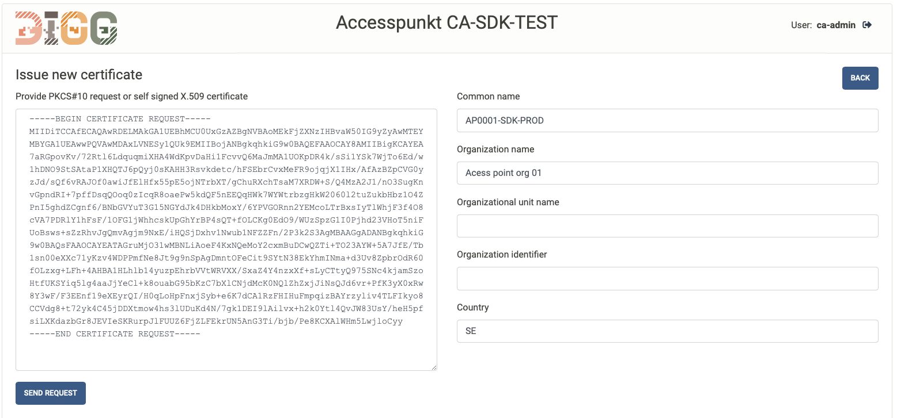
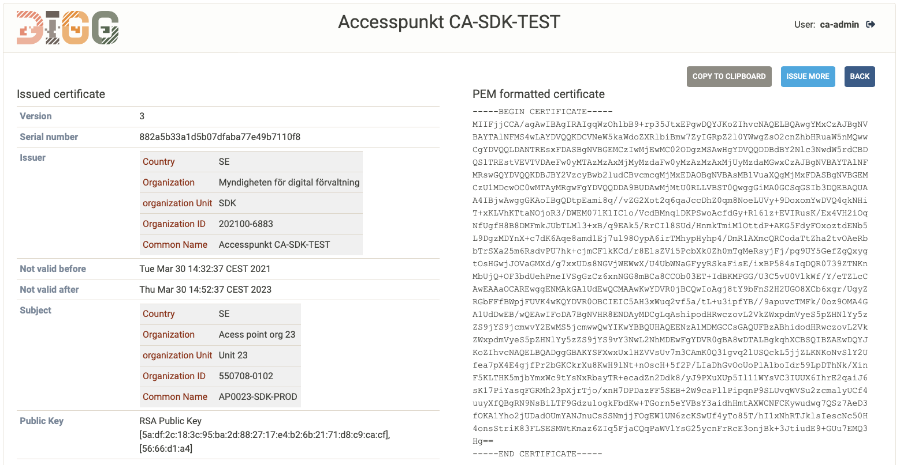
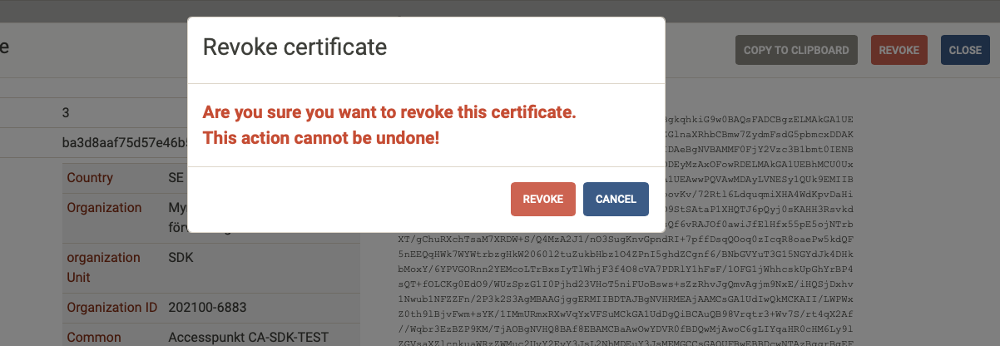

---
# CURRENT BUILD VERSION = 1.0.3
---
# Signature validation trust CA service


This repo contains the source code for the signature validation trust CA service. The source code builds a Spring Boot application that may be deployed as is, or may be built into a Docker image using any of the provided Dockerfile examples.

This document provides build, deployment and operational instructioins. Example files used to illustrate service deployment are provided in the `documentation/sample-config` folder.

The CA service application may hold any number of Certification Authority (CA) services, refered to as "**Instances**".

Each CA instance has its own administration web page, its own CA repository and its own revocation services. This CA service has a simple manual administration interface for issuing and revoking certificates. No API is provided for receiving and validating requests from other services by automated means. The administration UI of this service requires login using username and password. While OCSP and CRL:s allways must be made available on the public internet, the admin UI can be configured to be exposed on the main service port och can be directed to a secondary service port only made available on the local network.

## 1. Building artifacts
### 1.1. Building the source code

Building source codes refered to here requires maven version 3.3 or higher.

To build the eDelivery CA, a total of 3 projects need to be built in the following order:

 1. https://github.com/swedenconnect/ca-engine/tree/main/ca-engine (version 1.0.4)
 2. https://github.com/swedenconnect/ca-engine/tree/main/cmc (version 1.0.2)
 3. https://github.com/swedenconnect/ca-engine/tree/main/ca-service-base (version 1.1.7)
 4. https://github.com/swedenconnect/e-delivery-ca (This repo) (version 1.0.3)

The master branch of each repo holds the latest code under development. This is allways a SNAPSHOT version.
For deployment, it is advisable to build a release version. Each release have a corresponding release branch. To build the source code, select the release branch of the latest release version before building the source code.

Each one of the projects are built by executing the following command from the project folder containing the pom.xml file:

> mvn clean install

### 1.2 Building a docker image

Three sample Dockerfile files are provided:

Dockerfile | Description
---|---
Dockerfile  | Builds a docker image that exposes all relevant default ports
Dockerfile-debug  | Builds a docker image that allows attachment of a remote debugger on port 8000
Dockerfile-softhsm  | Builds a docker image that includes a SoftHSM and tools to load keys into the SoftHSM. This image is used to test the HSM PKCS#11 API.

A docker image can be built using the following command:

> docker build -f Dockerfile -t edelivery-ca .

Please refer to the Docker manual for instructions on how to build and/or modify these docker images.


## 2. Configuration

### 2.1. Environment variables
The following environment variables are essential to the CA application:

Environment variable | Description
---|---
`SPRING_CONFIG_ADDITIONAL_LOCATION`  | Specifies the absolute path location of the configuration data folder. This folder must specify a location that is available to the CA application and the CA application must have write access to this folder and all its sub-folders. The absolute path specified by this varable must end with a delimiter ("/") so that `${SPRING_CONFIG_ADDITIONAL_LOCATION}child` specifies the absolute path of the child folder. (Note: this is a rule set by Spring Boot).
`SPRING_PROFILES_ACTIVE`  | Specifies application profiles used by the CA service. This varialbe must be set to the value "`edelivery`"
`TZ`  | Specifies the timezone used by the application. This should be set to "`Europe/Stockholm`"

The `documentation/sample-config` folder contains sample configuration data. a corresponding folder must be available to the eDelivery CA application following the absolut path specified by `SPRING_CONFIG_ADDITIONAL_LOCATION`.


### 2.2. Configuration files
The configuraiton folder holds the following files and folders:

Resource | Description
--- | ---
`cfg` | Holds optional configuration data files applicable to the CA application such as logotype image files
`instances`  | holds configuration and data files related to all configured CA instances.
`application-edelivery.properties` | Main configuration file

#### 2.2.1. Instances folder

The `instances` folder includes one folder for each instance of the CA service. Each folder has the name equal to the id of the instance defined in the main configuration file `application-edelivery.properties`. In the sample configuration there are 2 instances named `rot01` and `ca01`, where rot01 is a root CA service and the ca01 instance is a CA used to issue certificates to eDelivery access points.

Each instance folder has 3 child folders as follows:

Folder | Description
--- | ---
`certs`  |  This folder is used to store certificates that are used to represent this CA instance.
`keys`  |  This folder contains any necessary key files used to load the private/public key pair of this CA instance.
`repository`  |  This folder contains CA repository files for issued certificates as well as certificate revocation lists (CRL).

##### 2.2.1.1. Certs folder

The **certs** folder is populated by the following files on instance initialization:

File | Description
---|---
`ca-chain.pem`  | This file holds the chain of certificates used by the CA to represent a path to a trusted root certificate. This file is initially created containint a signle certificate, being the self issued CA certificate stored in the ca-self-signed.crt file. This file may be modified manually by the administrator if this CA is certified by another CA in order to create a path to a trusted root. If this file is modified, then all certificates including the trusted root certificate must be included. The certificates shold be stored in the order from the CA certificate first and the root certificate last. All certificate must be stored in its PEM format.
`ca-self-signed.crt`  | This file holds the self signed CA certificate created for this CA instance at initalization.
`ocsp.crt` | This certificate appears if, and only if, the CA is configured include an OCSP responder and a separate key pair is provided for the OSCP responder. The OCSP responder certificate can be re-issued by deleting this certificate and restarting the service. The OSCP responder can be re-keyed by replacing the OCSP responder key pair and deleting this certificate and restarting the service.

##### 2.2.1.2 Keys folder
The **keys** folder is used to store files holding key pair data for the CA instance. The files stored here are different depending on the key type specified in the configuration data as follows:

Key type | content in keys folder
---|---
`jks`  |  Stores Java key store files for the CA and for the OCSP responder (if applicatble). File names must end with `ca.jks` for CA keys and `ocsp.jks` for OCSP keys.
`pkcs12`  |  Stores PKCS#12 files for the CA and for the OCSP responder (if applicatble). File names must end with `ca.p12` for CA keys and `ocsp.p12` for OCSP keys.
`pkcs11` | Applicable if the private key is stored in an external HSM device. This folder must contain a certificate file for the public key of the corresponding private key in the HSM. File names must end with `ca.crt` for CA keys and `ocsp.crt` for OCSP keys.
`pem`  |  Stores private keys and public key certificates in separate files. File names must end with `ca.key` for CA keys, `ca.crt` for CA public key certificates, `ocsp.key` for OCSP keys and `ocsp.crt` for OCSP public key certificates.
`create`  |  empty
`none`  |  empty

Note that `create` option is only for test and causes the service to generate new keys at every startup. The option `none` means no key and this option is selected for OCSP responders that will issue OCSP responses using the CA key instead of a separate key for a separate OCSP responder entity.

##### 2.2.1.3 Repository folder

The repository folder is internally used by the CA instance to store data related to the CA repository and issued revocation data.

#### 2.2.2. Application properties configuration

Configuraiton data for the service an all CA instances are specified in the `application-edelivery.properties` file. Properties settings are divided into sub categories as follows:

##### 2.2.2.1 Process logging levels

Process logging levels are set accoreding to Spring Boot conventions. Two logging levels are preset:

Logging level property | Description
---|---
logging.level.se.swedenconnect.ca  |  Setting logging level for the CA service.
logging.level.se.swedenconnect.opensaml.pkcs11  |  Setting logging level for processes related to HSM usage

Logging levels can be set to the values: `TRACE`, `DEBUG`, `INFO`, `WARN` or `ERROR`

##### 2.2.2.2 Users

Users are added to the system through property settings in the form:

> ca-service.security.user.{user-id}.password={user-password}<br>
> ca-service.security.user.{user-id}.role[0]={instance-id}<br>
> ca-service.security.user.{user-id}.role[1]={instance-id}<br>

The user ID is set by the parameter {user-id} and each instance of the CA this user is allowed to access and administer is listed as a role index value. The following settings illustrate configuration of 2 users (root-admin and ca-admin) where the root-admin user has access to the instances rot01 and ca01, while the ca-admin just has access to the ca01 instance.

```
ca-service.security.user.root-admin.password=user1pass
ca-service.security.user.root-admin.role[0]=rot01
ca-service.security.user.root-admin.role[1]=ca01
ca-service.security.user.ca-admin.password=user2pass
ca-service.security.user.ca-admin.role[0]=ca01

```

##### 2.2.2.3 Main service settings

All regular general Spring Boot application.properties settings apply to this service. In addition to these properties, this service define a number of its own general service settings.
The following properties should be set to appropriate values:

Propety | Value
---|---
server.port | The main server port. Default 8080
ca-service.config.control-port | The alternative internal server port. Default 8006
ca-service.config.base-url | The base URL of the CA service (Only protocol and host name such as: https://edelivery.idsec.se), not inlcuding any path information.
ca-service.config.verbose-cert-print | Determines the level of detail in presentatioin of certificate informatioin. Default set to `false`. Setting this to true will for example print the content of signature values and key parameters.
ca-service.policy.admin.enabled-ui-ports | The ports that are allowed to expose the admin UI. See details below.
ca-service.config.logo | The path to the logo of the servie. Typically set to ${ca-service.config.data-directory}cfg/logo.svg
ca-service.config.icon | The path to the icon of the servcice. Typically set to ${ca-service.config.data-directory}cfg/icon.svg

Note: The `ca-service.policy.admin.enabled-ui-ports` property includes a list of allowed ports for the admin UI. A setting that would allow all relevant ports is: ${server.port},${ca-service.config.control-port},443,8443. This setting allows the service to expose the Admin UI on ports 8080, 8006, 443 and 8443. The use of AJP makes this setting somewhat more complex as the AJP protocol hides the local port used between the webserver and the application server and presents the port used to access the service at the webserver. As such, the recommended settings with and without AJP are:

AJP | Use cse | Allowed port settings
---|---|--
With AJP  | Admin UI publically exposed | 443
No AJP  | Admin UI publically exposed | ${server.port}, 8443 (if internal SSL is used)
With or without AJP  | Admin UI on intranet only  | ${ca-service.config.control-port}

**Certified key constraints**

These settings defines the allowed public key types and minimum key length requirements for this CA to allow certification of a presented public key in a certification request.

Propety | Value
---|---
ca-service.policy.rsa-keys-allowed | Set to true to allow RSA public keys
ca-service.policy.rsa-min-key-len | Minimum RSA key length. Default 3072
ca-service.policy.ec-keys-allowed | Set to true to allow Elliptic Curve (EC) public keys
ca-service.policy.ec-min-key-len | Minimum EC key length. Default 256

##### 2.2.2.4 TLS configuration

The Spring boot application may provide its services over encrypted TLS as alternative to the main service port. This communication is allways offered on port 8443. TLS is configured using the following standard Spring Boot properties

Propety | Value
---|---
server.ssl.key-store | Location of the TLS server key and certificate such as ${ca-service.config.data-directory}cfg/sslSnakeOil.p12
server.ssl.key-store-type | Key store type, such as `PKCS12`
server.ssl.key-store-password | Key store password
server.ssl.key-password | Key password
server.ssl.enabled | Set to true to enable TLS

These settings are disabled by default

##### 2.2.2.5 AJP port configuration

AJP is disabled by default. AJP protocol support can be enabled ans specified using the following property settings:

Propety | Value
---|---
tomcat.ajp.enabled | Set to true to enable AJP support
tomcat.ajp.port | Set the AJP port. Typically 8009
tomcat.ajp.secret | Sets an AJP secret to enahce security between the application and the web server. If this secret is absent, then AJP is provided with secure mode set to false and without AJP secret. This is not recommended for production environments.

##### 2.2.2.6 Syslog configuration

The CA service offers process logging for the purpose of monitoring the service and to debug problems.
This log does not need to be maintained over time.

In addition to this the CA service provides an audit log with information on important events to support audit of the service. This log is intended to be archived to allow future audits.

The audit log can be directed to external syslog servers. For details on syslog configuration, see section 5.

##### 2.2.2.7 PKCS#11 configuration

PKCS#11 configuration is only applicable if the service is connected to a HSM key source. For more details on HSM configuration, see chapter 4.

##### 2.2.2.8 CA instance configuration
The CA service may provide any number of CA instances where each instance have its own set of keys, CA identity, CA settings and revocation services.

A typical configuration is to create a CA service with 2 instances, where one instance is a root CA and the other is the CA used to issue certificates to access points.

For a more secure setup, the Root CA should be established as a separate service deployment, completely separated from the CA issuing end entity certificates.

###### 2.2.2.8.1 CA instance key source configuration

The basic asset of a CA instance is its key sources. A CA may have one or two key soruces:

1. The CA key source used to sign certificates and CRL (Certificate revocation lists).
2. An optional OCSP key soruce used if the OCSP responder is provided by a separate entity with its own issuing key.

If no OCSP key source is specified, then this instance will issue OCSP responses (if OCSP is enabled) using the CA key instead of using a separate OCSP key.

A key sources are setup using the following parameters :

Key soruce parameter | Value
---|---
type  |  Specifies the type of key soruce. See section 2.2.1.2 for the different key source types
alias  |  The alias/name of the key. for jks and pkcs12 key sources this value is the key alias in the key store. for pkcs11 this is the id of the key in the HSM and for pem keys this parameter is ignored.
pass  |  Password/secret used to access the key. for pem keys this is the key decryption password if the key is encrypted. If the pem key is no encrypted, this paramter is ignored.
reloadable-keys  |  A parameter relevant to HSM keys only. A value of true introduce a key test before using the HSM key to make sure the key is still attached to the service. If the key is no longer avaliable, and attemt to reload the key is done before usage. Setting this to true have a small performance penalty, but generally should be set to true for HSM key sources.

The property name format for a ca key is:
> ca-service.instance.conf.{instance-id}.ca.key-source.{parameter-name}

The property name format for an ocsp key is:
> ca-service.instance.conf.{instance-id}.ocsp.key-source.{parameter-name}

Example of key source configuraiton for the CA instance named ca01 with ca and ocsp key:

```
ca-service.instance.conf.ca01.ca.key-source.type=pkcs11
ca-service.instance.conf.ca01.ca.key-source.alias=ca01-key
ca-service.instance.conf.ca01.ca.key-source.pass=1234
ca-service.instance.conf.ca01.ca.key-source.reloadable-keys=true
ca-service.instance.conf.ca01.ocsp.key-source.type=jks
ca-service.instance.conf.ca01.ocsp.key-source.alias=ocsp
ca-service.instance.conf.ca01.ocsp.key-source.pass=secret

```

###### 2.2.2.8.2 CA instance service configuration

Instance service configuration is provided as a defaut configuration profile followed by
specific configuration parameters for each instance that differes from the default parmeter.

property parameter namining for instance service configuration follows the following structure:

> ca-service.instance.conf.{instance-id}.{entity=ca/ocsp}.{parameter-name}

The instance-id for the default profile is "`default`"

The following parameters are available for the "ca" entity type:

Parameter | Value
---|---
type  | The type of CA instance. The available values are "ca" and "root". The value determines the certificate content profile for issued certificates.
description  | A Short description of the instance CA service.
algorithm | URI identifier of the algorithm used to sign certificates and revocation data. E.g. `http://www.w3.org/2001/04/xmldsig-more#rsa-sha256`
allow-v1 | True if this CA is allowed to isssue X.509 V1 certificates. Note that certificates with extensions are allways V3 certificates. Default false.
self-issued-valid-years | The number of years the autogenerated self issued certificate will be valid
validity.start-offset-sec | The number of seconds before the actual issue time, issued certificates will be valid from. This allows time skew between the issuing service and certificate verifiers.
validity.unit | The unit type for validity period settings of issued certificates. Unit alternatives are "M", "H", "D" or "Y" for Minute, Hour, Day or Year (case insensitive)
validity.amount | The amount of time units issued certificates will be valid
crl-validity.start-offset-sec | Same as `validity.start-offset-sec`, but for CRL validity period.
crl-validity.unit | same as `validity.unit`, but for CRL validity period.
crl-validity.amount | same as `validity.amount`, but for CRL validity period.

The following parameters are available for the "ocsp" entity type:

Parameter | Value
---|---
enabled | A value of true enable OCSP responder for this CA instance
algorithm | URI identifier of the algorithm used to sign OCSP responses
validity.start-offset-sec | Same as `validity.start-offset-sec`, but for OCSP validity period.
validity.unit | Same as `validity.unit`, but for OCSP validity period.
validity.amount | Same as `validity.amount`, but for OCSP validity period. Howver a value of "0" means that the OCSP response will not have a "Next update" time set. This is the typical configuratin when OCSP responses is issued directly based on the CA repository source (The information is allways fresh).


THe follwoing example illustrates typical default and instance service configuration for the instances named ca01 and rot01:

```
ca-service.instance.conf.default.ca.algorithm=http://www.w3.org/2001/04/xmldsig-more#rsa-sha256
ca-service.instance.conf.default.ca.allow-v1=false
ca-service.instance.conf.default.ca.self-issued-valid-years=10
ca-service.instance.conf.default.ca.validity.start-offset-sec=-20
ca-service.instance.conf.default.ca.validity.unit=Y
ca-service.instance.conf.default.ca.validity.amount=2
ca-service.instance.conf.default.ca.crl-validity.start-offset-sec=0
ca-service.instance.conf.default.ca.crl-validity.unit=H
ca-service.instance.conf.default.ca.crl-validity.amount=2
ca-service.instance.conf.default.ocsp.enabled=true
ca-service.instance.conf.default.ocsp.algorithm=${ca-service.instance.conf.default.ca.algorithm}
ca-service.instance.conf.default.ocsp.validity.start-offset-sec=-10
ca-service.instance.conf.default.ocsp.validity.unit=H
ca-service.instance.conf.default.ocsp.validity.amount=0


ca-service.instance.conf.rot01.enabled=true
ca-service.instance.conf.rot01.ca.type=root
ca-service.instance.conf.rot01.ca.description=Root CA service for certification of Access point CA services
ca-service.instance.conf.rot01.ca.validity.amount=10
ca-service.instance.conf.rot01.ca.name.common-name=DIGG eDelivery Rot CA-TEST
ca-service.instance.conf.rot01.ca.self-issued-valid-years=20
ca-service.instance.conf.rot01.ca.crl-validity.unit=D
ca-service.instance.conf.rot01.ca.crl-validity.amount=35
ca-service.instance.conf.rot01.ocsp.enabled=false

ca-service.instance.conf.ca01.enabled=true
ca-service.instance.conf.ca01.ca.type=ca
ca-service.instance.conf.ca01.ca.description=CA service for issuing certificates to Access points within the Swedish eDelivery test infrastructure
ca-service.instance.conf.ca01.ca.validity.amount=2
ca-service.instance.conf.ca01.ca.name.common-name=Accesspunkt CA-SDK-TEST
ca-service.instance.conf.ca01.ca.self-issued-valid-years=10
ca-service.instance.conf.ca01.ocsp.name.common-name=Accesspunkt CA-SDK-TEST OCSP Responder
```


## 3. Operation
### 3.1. Running the docker container

The following provides a sample docker start command to run the service as docker container.
The image name of this example is set to `edelivery-ca`. This name can however be set to any suitable tag name when building the docker image.


```
docker run -d --name edelivery-ca --restart=always \
  -p 9070:8080 -p 9079:8009 -p 9073:8443 -p 9077:8000 -p 9076:8006 -p 9078:8008 \
  -e "SPRING_CONFIG_ADDITIONAL_LOCATION=/opt/ca/" \
  -e "SPRING_PROFILES_ACTIVE=edelivery" \
  -e "TZ=Europe/Stockholm" \
  -v /etc/localtime:/etc/localtime:ro \
  -v /opt/docker/edelivery-ca-hsm:/opt/ca \
  edelivery-ca
```

### 3.2 Setting up a new CA instance

A new CA instance is created using the following procedure:

1. Create an instance data folder with the instance-id as the folder name, and then create a subfolder named "keys" inside the instance folder.
2. Generate keys for the CA and its OCSP responder and store the applicable files in the "keys" folder.
3. Update the application-edelivery.properties file with approprieate property settings for the new instance.
4. Restart he CA service. This will cause the service to initialize the new instance CA repository and to generate new self issued CA certificate and OCSP certificate in the "repository" and the "certs" folders.

If this CA instance is a root CA, then stop here.
If this CA is a CA that should be signed by a root CA, then proceed as described in the nest steps below. These instructioins assumes that the new instance created through step 1-4 is named "new-ca" and that it will be signed by an existing ca named "root-ca".

5. Locate the self-issued CA certificate in the certs folder of "new-ca".
6. Login to the CA and the Root CA instance named "root-ca" that should issue a CA certificate to the new CA instance "new-ca".
7. Use the "root-ca" instance to issue a new certificate to the new CA instance "new-ca". Use the self-issued certificate obtained from "new-ca" in step 5 in the request.
8. Replace the content of the file "ca-chain.pem" in the instance "new-ca". Remove the existing self signed certificate and place instead the following certificates in this order:<br>
   a. The new certificate issued by "rot-ca" in step 7<br>
   b. The self issued certificate of "rot-ca".
9. Restart the CA service

### 3.3 Issue and revoke certificates

#### 3.3.1 Issue certificates
After logging in to the CA service and selecting an instance, the administrator has the option to issue and revoke certificates through the amin UI.

The "ISSUE CERTIFICATE" button opens up a certificate request dialogue:



This provides a text area where the administrator can paste either a silf-signed certificate or a PKCS#10 request provided by the certificate applicant requesting a certificate. The request data is checked and validated against policy requirements such as minimum key requirements and identification of illegal input values.

The adminstrator can then freely alter any naming information provided in the request by entering appropriate values in the text fields to the right. Once all information is correct, the administrator press the "SEND REQUEST" button.

A final approve dialogue is presented before the request is sent to the CA instance:


Once issued, the administrator can inspect the issued certificate in the issue result dialogue:



Here the administator can choose to copy/paste the new certificate, issue more certificates or return to the amin UI.

#### 3.3.2 Revoke certificates

Certificate can be reoked through the admin UI by selecting the target certificate and press the "MANAGE" button and then select the "REVOKE" button. Note that the revoke button is only available if the certificate is not yet revoked.

After selecting revocation, the administrator will have to re-confirm revocation before revocation is executed:




## 4 HSM configuration

External PKCS#11 tokens, as well as softhsm PKCS#11 tokens can be configured through the following properties in application-edelivery.properties:

Parameter | Value
---|---
`ca-service.pkcs11.lib` | location of pkcs#11 library
`ca-service.pkcs11.name` | A chosen name of the PKCS#11 provider. The actual name of the provider will be "SunPKCS11-{this name}-{index}".
`ca-service.pkcs11.slotListIndex` | The start slot index to use (default 0).
`ca-service.pkcs11.slotListIndexMaxRange` | The maximum number of slots after start index that will be used if present. Default null. A null value means that only 1 slot will be used.
`ca-service.pkcs11.slot` | The actual name of the slot to use. If this parameter is set, then slotListIndex should not be set.
`ca-service.pkcs11.external-config-locations` | Specifies an array of file paths to PKCS#11 configuration files used to setup PKCS11 providers. **If this option is set, all other options above are ignored**.
`ca-service.pkcs11.reloadable-keys` | Specifies if private keys shall be tested and reloaded if connection to the key is lost, prior to each usage. Using this option (**true**) have performance penalties but may increase stability.


Soft HSM properties in addition to generic PKCS#11 properties above. Note that for soft hsm, the parameters slot, slotListIndex and slotListIndexMaxRange are ignored.

Parameter | Value
---|---
`ca-service.pkcs11.softhsm.keylocation` | The location of keys using the name convention alias.key and alias.crt.
`ca-service.pkcs11.softhsm.pass` | The pin/password for the soft hsm slot to use. This pin/password should be configured as the password for each configured key.

## 5 Audit logging to syslog

Audit logs can be sent to Syslog by:

1. Setting `application-edelivery.properties` property `ca-service.syslog.enabled` to the value **true**
2. Configuring available syslog hosts in the configuration file `application-edelivery.properties`.

**Note:** If syslog is **not** enabled according to step 1 above, then the auditlog will be available through the managment port according to section 6, under the relative path "auditevents". (E.g http://localhost:8008/manage/auditevents).

Parameters are specified in the form: `ca-service.syslog.config[index].{parameter}` illustrated by the example below.

**Sample syslog.properties file:**

```
# Parameters:
# - host           : Hostname or IP addresses
# - port           : TCP or UDP port
# - protocol       : udp, tcp or ssl
# - bsd            : Using message format RFC_3164 when set to true. Using RFC_5424 (UDP) or RFC_5425
#                  : (TCP) when false
# - facility       : The syslog facility identifier (0-23)
# - loglevel       : The log level for logging (Default INFORMATIONAL) or set to either numerical or
#                  : label that is one of:
#                  : 0 - EMERGENCY, 1 - ALERT, 2 - CRITICAL, 3 - ERROR, 4 - WARNING, 5 - NOTICE,
#                  : 6 - INFORMATIONAL, 7 - DEBUG
# - clienthostname : Name of the sending client host. If absent, the client host is set to the value
#                  : of the environment variable "HOSTNAME".
# - clientapp      : Name of the sending client application

ca-service.syslog.enabled=true
ca-service.syslog.config[0].host=10.1.1.101
ca-service.syslog.config[0].port=601
ca-service.syslog.config[0].protocol=tcp
ca-service.syslog.config[0].bsd=false
ca-service.syslog.config[0].facility=13
ca-service.syslog.config[0].clientapp=ca-service
ca-service.syslog.config[1].host=10.1.1.102
ca-service.syslog.config[1].port=514
ca-service.syslog.config[1].protocol=udp
ca-service.syslog.config[1].bsd=false
ca-service.syslog.config[1].facility=14
ca-service.syslog.config[1].clientapp=ca-service
```

## 6 Monitoring service

The CA application can be monitored remotely through configurable url and port. Monitoring is provided using Spring boot actuator and is configured through settings in application.properties as follows.

parameter | Value
---|---
management.server.base-path | The path to the monitoring service. Typically set to "/manage"
management.server.port | The tcp port at which the information is available
management.server.ssl.enabled | Set to true to enable SSL/TLS protection
management.endpoint.info.enabled | Enabling the "info" feed on /info if set to `true`
management.endpoint.health.enabled | Enabling the health feed on /health if set to `true`
management.endpoint.auditevents.enabled | Enabling the audit events feed on /auditevents if set to `true`
management.endpoints.web.exposure.include | Default "*"
management.endpoints.web.base-path | Default "/"
management.server.ssl.key-store= | Key store path
management.server.ssl.key-store-password | Key store password
management.server.ssl.key-password | Key password
management.server.ssl.key-store-type | Keystore type (e.g. "PKCS12")
management.server.ssl.key-alias | Keystore alias


URL:s provide information about the service as follows:

> http[s]://{service-IP-address}:{management.port}{management.context-path}{resource-name}

A typical URL for the "info" resource is:

> http://localhost:8008/manage/info

The following resources are available:

resource-name | Description
--- | ---
health | Service health indication
info | Information about the service
auditevents | Audit log (If no syslog server is assigned)

**Example: "health"**

```
{"status":"UP"}
```

**Example: "info"**

```
{
    "build": {
        "artifact": "ca-service-base",
        "name": "ca-service-base",
        "time": "2021-03-28T19:13:31.355Z",
        "version": "1.0.0",
        "group": "se.swedenconnect.ca"
    },
    "CA-service-information": {
        "serviceUrl": "https://edelivery.idsec.se/ca",
        "contextPath": "/ca",
        "servicePort": 8080,
        "adminPort": 8006,
        "managePort": 8008,
        "ajpConfig": {
            "port": 8009,
            "secret": true
        },
        "caInstances": [
            {
                "id": "ca01",
                "enabled": true,
                "serviceType": "ca",
                "keySourceType": "pkcs11",
                "keyInfo": {
                    "keyType": "RSA",
                    "keyLength": 3072
                },
                "algorithm": "http://www.w3.org/2001/04/xmldsig-more#rsa-sha256",
                "dn": "C=SE,O=Myndigheten för digital förvaltning,OU=SDK,organizationIdentifier=202100-6883,CN=Accesspunkt CA-SDK-TEST",
                "caPath": [
                    "C=SE,O=Myndigheten för digital förvaltning,OU=SDK,organizationIdentifier=202100-6883,CN=Accesspunkt CA-SDK-TEST",
                    "C=SE,O=Myndigheten för digital förvaltning,OU=SDK,organizationIdentifier=202100-6883,CN=DIGG eDelivery Rot CA-TEST"
                ],
                "crlDistributionPoints": ["https://edelivery.idsec.se/ca/crl/ca01.crl"],
                "oscpEnabled": true,
                "ocspInfo": {
                    "ocspServiceUrl": "https://edelivery.idsec.se/ca/ocsp/ca01",
                    "separateEntity": true,
                    "ocspEntity": {
                        "dn": "C=SE,O=Myndigheten för digital förvaltning,OU=SDK,organizationIdentifier=202100-6883,CN=Accesspunkt CA-SDK-TEST OCSP Responder",
                        "keySourceType": "pkcs11",
                        "keyInfo": {
                            "keyType": "RSA",
                            "keyLength": 3072
                        },
                        "algorithm": "http://www.w3.org/2001/04/xmldsig-more#rsa-sha256"
                    }
                }
            },
            {
                "id": "rot01",
                "enabled": true,
                "serviceType": "root",
                "keySourceType": "pkcs11",
                "keyInfo": {
                    "keyType": "RSA",
                    "keyLength": 3072
                },
                "algorithm": "http://www.w3.org/2001/04/xmldsig-more#rsa-sha256",
                "dn": "C=SE,O=Myndigheten för digital förvaltning,OU=SDK,organizationIdentifier=202100-6883,CN=DIGG eDelivery Rot CA-TEST",
                "caPath": ["C=SE,O=Myndigheten för digital förvaltning,OU=SDK,organizationIdentifier=202100-6883,CN=DIGG eDelivery Rot CA-TEST"],
                "crlDistributionPoints": ["https://edelivery.idsec.se/ca/crl/rot01.crl"],
                "oscpEnabled": false,
                "ocspInfo": null
            }
        ]
    }
}
```
